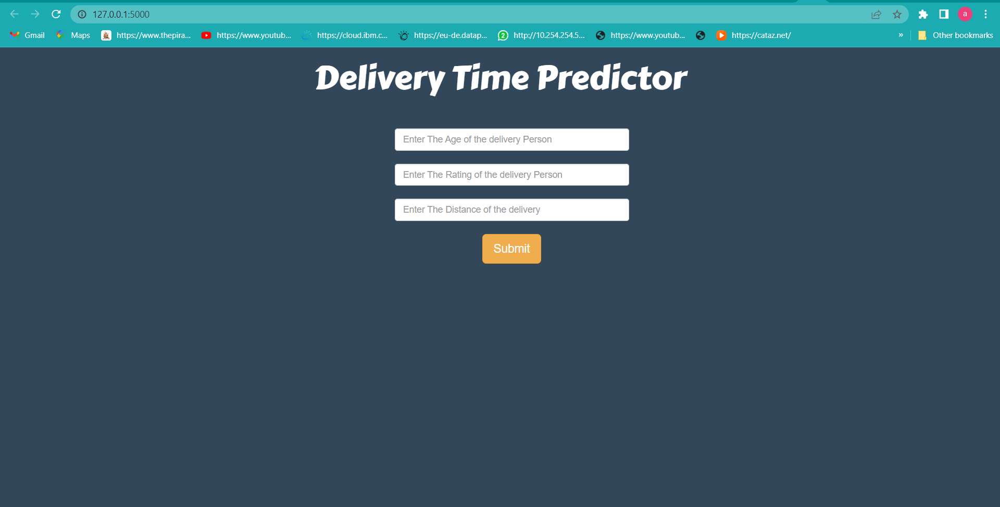
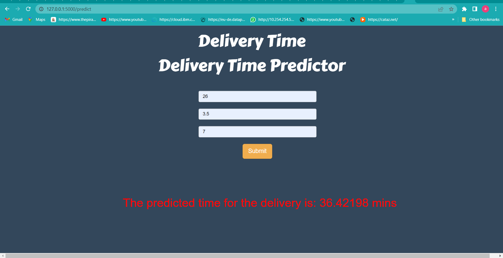

# Food-Delivery-Time-Prediction-System

----------------------------------------

### Software and Tools Requirements
1. [GitHub Account](https://www.github.com) 
2. [Pycharm IDE](https://www.jetbrains.com/pycharm) 
3. [GitCLI](https://git-scm.com/downloads)
4. [python]()
5. [Anaconda]()
6. [jupyter]()
7. [Keras]()
8. [Plotly]()
9. [numpy]()
10. [Pandas]()

----------------------------------------------------

This is an End to End Project where a web app is created to show how the model works and
interacts with the a front end structure.

The screenshot of the web app are given below:

The above webpage show the front end of the app where three fields are there as inputs :
1. Age of the Delivery Person
2. Rating of the Delivery Person
3. Distance of the Delivery

The output will be the predicted time for the delivery.The below image shows the output

The model is trained using LSTM algorithm and using Keras
